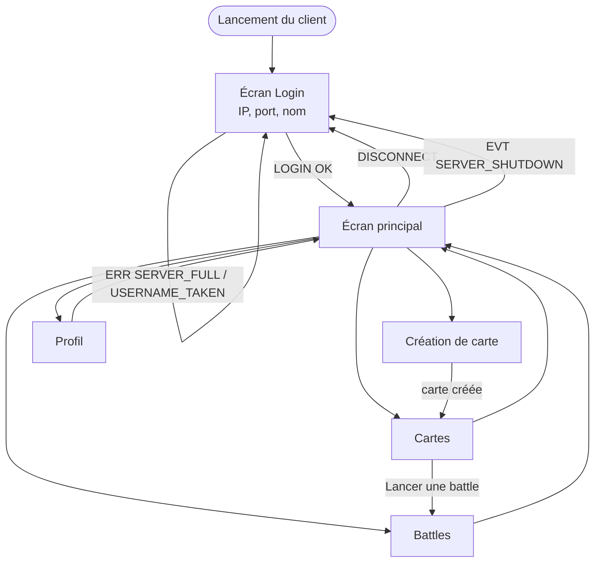
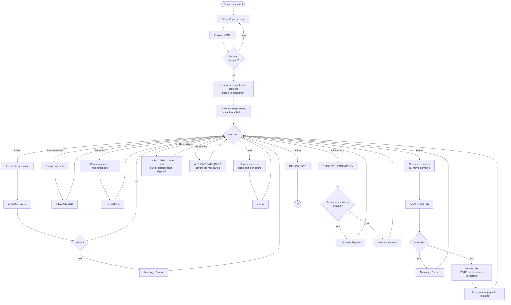

# Annexe A — Parcours utilisateur

Cette annexe montre comment un utilisateur traverse l'application et comment l'interface (GUI) échange avec le modèle et le serveur. Elle sert de lien entre les [maquettes](architecture-client.md) et le [protocole](protocole-applicatif-commun.md).

## A.1 Navigation générale (`diagrammes-generaux/02-navigation-javafx.png`)

<!-- png: diagrammes-generaux/02-navigation-javafx.png -->

## A.2 Parcours principal (`diagrammes-generaux/03-parcours-utilisateur.png`)

Ce schéma suit un utilisateur de la connexion à la déconnexion. Les losanges sont des décisions de l'utilisateur ou du serveur ; les actions du serveur sont en gras.

<!-- png: diagrammes-generaux/03-parcours-utilisateur.png -->

## A.3 Échange entre GUI, modèle et serveur

Pour toute action, l'interface suit le même schéma :

1. L'utilisateur clique sur un bouton. Le contrôleur contrôle les champs.
2. Le contrôleur demande à la couche réseau d'envoyer la requête et affiche un indicateur d'attente.
3. Le serveur valide, mine, enregistre, puis répond.
4. À la réponse, le contrôleur met à jour le modèle ; les vues liées au modèle se rafraîchissent.
5. Les autres clients reçoivent l'événement `EVT` correspondant et mettent à jour leur modèle.

Le détail seconde par seconde de chaque action est dans les [diagrammes de séquence](annexe-d-sequences.md).

## A.4 Parcours de deux utilisateurs pendant une battle

| Temps | Alice (propriétaire de Python) | Bob (propriétaire de R) | Carol (tiers) | Serveur |
| :--- | :--- | :--- | :--- | :--- |
| 0 s | `START_BATTLE\|1\|2` | — | — | Valide (même domaine, VA ≥ 5), mine, `EVT BATTLE_STARTED` |
| 5 s | Voit le compte à rebours | Voit le compte à rebours | Voit les boutons de vote | — |
| 10 s | Boutons de vote désactivés | Boutons de vote désactivés | `VOTE\|1\|1` | Mine le bloc de vote, `EVT VOTE_CAST` |
| 60 s | — | — | — | Calcule le vainqueur, transfère les recommandations, `EVT BATTLE_ENDED` |
| 61 s | Python : gagnante | R : `INACTIVE` | Voit le résultat | — |
