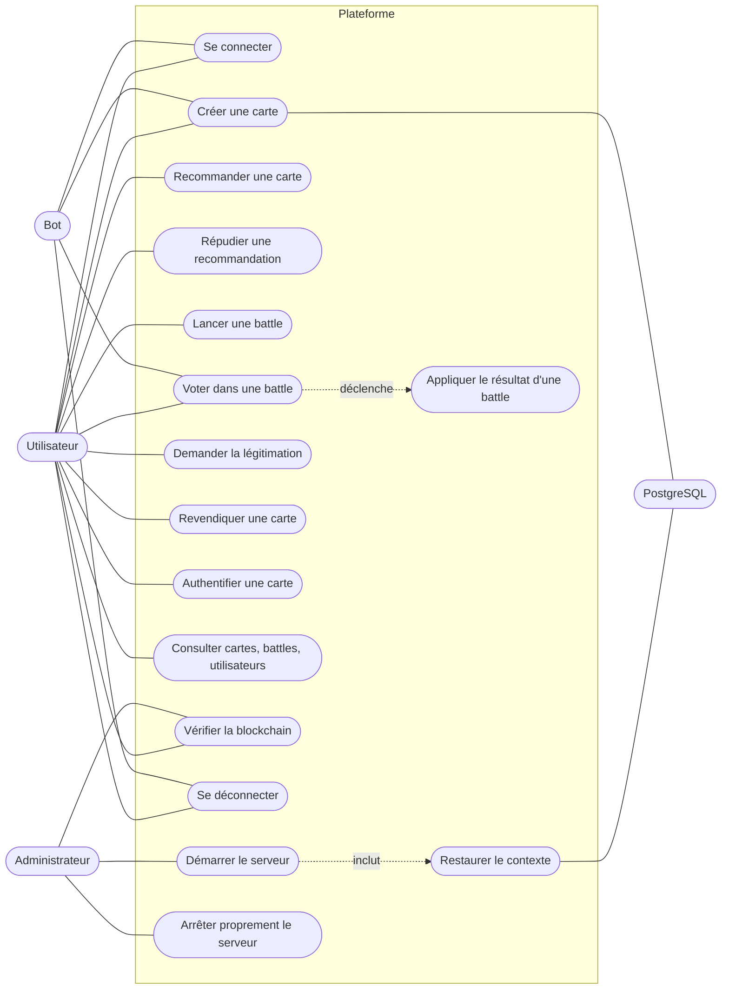
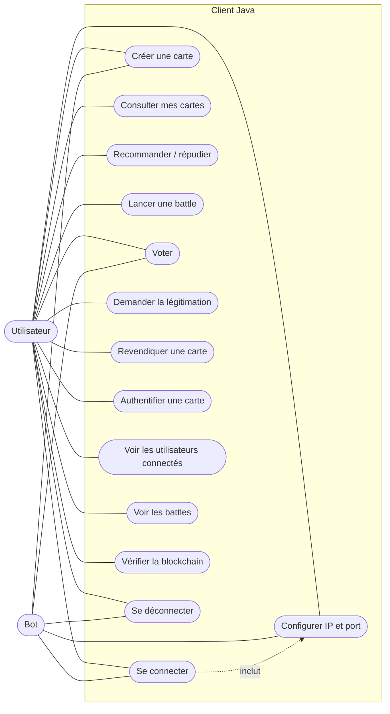
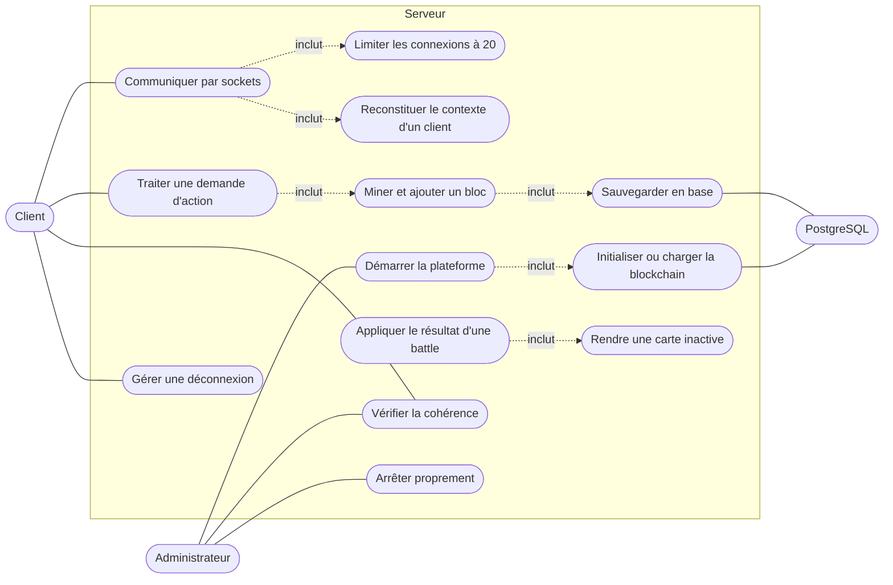

# Annexe B — Cas d'utilisation

Cette annexe présente les cas d'utilisation de la plateforme. Ils reprennent les 27 cas du cahier des charges, regroupés par acteur. Les diagrammes sont écrits en Mermaid (les acteurs sont en rectangles arrondis, les cas en ellipses).

## B.1 Acteurs

| Acteur | Description |
| :--- | :--- |
| Utilisateur | Humain connecté avec le client JavaFX |
| Bot | Client automatique, `kind = BOT` |
| Administrateur | Personne qui lance et arrête le serveur depuis sa console |
| PostgreSQL | Système externe qui sauvegarde la blockchain |

## B.2 Cas d'utilisation global (`diagrammes-generaux/01-cas-utilisation-global.png`)

<!-- png: diagrammes-generaux/01-cas-utilisation-global.png -->

## B.3 Cas d'utilisation du client (`diagrammes-client/01-diagramme-cas-utilisation.png`)

<!-- png: diagrammes-client/01-diagramme-cas-utilisation.png -->

## B.4 Cas d'utilisation du serveur (`diagrammes-serveur/00-cas-utilisation-serveur.png`)

<!-- png: diagrammes-serveur/00-cas-utilisation-serveur.png -->

## B.5 Correspondance avec le cahier des charges

| N° | Cas du cahier des charges | Où il est traité |
| :--- | :--- | :--- |
| 1 | Démarrer la plateforme | Serveur : démarrage, [architecture-serveur.md](architecture-serveur.md) §7 |
| 2 | Initialiser ou charger la blockchain | [architecture-serveur.md](architecture-serveur.md) §7, [schema-bdd.md](schema-bdd.md) §5 |
| 3 | Communiquer avec les clients | [protocole-applicatif-commun.md](protocole-applicatif-commun.md) |
| 4 | Limiter les connexions simultanées | `MAX_CLIENTS = 20`, [donnees-serveur.md](donnees-serveur.md) |
| 5 | Configurer la connexion d'un client | Écran de login, [architecture-client.md](architecture-client.md) |
| 6 | Types de clients | Humain et bot, [architecture-client.md](architecture-client.md) §9 |
| 7 | Reconstituer le contexte d'un utilisateur | `LOGIN` puis `LIST_*`, [protocole](protocole-applicatif-commun.md) §4.1 |
| 8 | Traiter une demande d'action | Pipeline, [architecture-serveur.md](architecture-serveur.md) §5 |
| 9 | Traitement concurrent | Un thread par client, minage sans verrou |
| 10 | Actions minimales | [protocole](protocole-applicatif-commun.md) §4 |
| 11 | Créer une carte | `CREATE_CARD`, [règles métier](regles-metier.md) §1 |
| 12 | Recommander une carte | `RECOMMEND`, [règles métier](regles-metier.md) §2 |
| 13 | Consulter recommandations | `LIST_CARDS\|RECOMMENDED`, `LIST_RECEIVED` |
| 14 | Répudier | `REPUDIATE` |
| 15 | Lancer une battle | `START_BATTLE`, [règles métier](regles-metier.md) §3 |
| 16 | Voter | `VOTE` |
| 17 | Appliquer le résultat | `ACTION_BATTLE_RESULT`, [règles métier](regles-metier.md) §3.5 |
| 18 | Demander une légitimation | `REQUEST_LEGITIMATION`, [règles métier](regles-metier.md) §4.1 |
| 19 | Revendiquer | `CLAIM_CARD`, [règles métier](regles-metier.md) §4.2 |
| 20 | Authentifier | `AUTHENTICATE_CARD`, [règles métier](regles-metier.md) §4.3 |
| 21 | Rendre une carte inactive | Perdante d'une battle, [règles métier](regles-metier.md) §3.5 |
| 22 | Restaurer le contexte | Rejeu des blocs, [structures-blockchain.md](structures-blockchain.md) §7 |
| 23 | Interface graphique | [architecture-client.md](architecture-client.md) §8 |
| 24 | Client automatique | Bot, [architecture-client.md](architecture-client.md) §9 |
| 25 | Déconnexion d'un client | [architecture-serveur.md](architecture-serveur.md) §9 |
| 26 | Vérifier la cohérence | `VERIFY_CHAIN`, [structures-blockchain.md](structures-blockchain.md) §5 |
| 27 | Arrêter proprement le serveur | [architecture-serveur.md](architecture-serveur.md) §8 |

Aucun cas d'utilisation supplémentaire n'est ajouté à ceux du cahier des charges. Le partage ciblé, facultatif, n'est pas retenu pour cette version.
