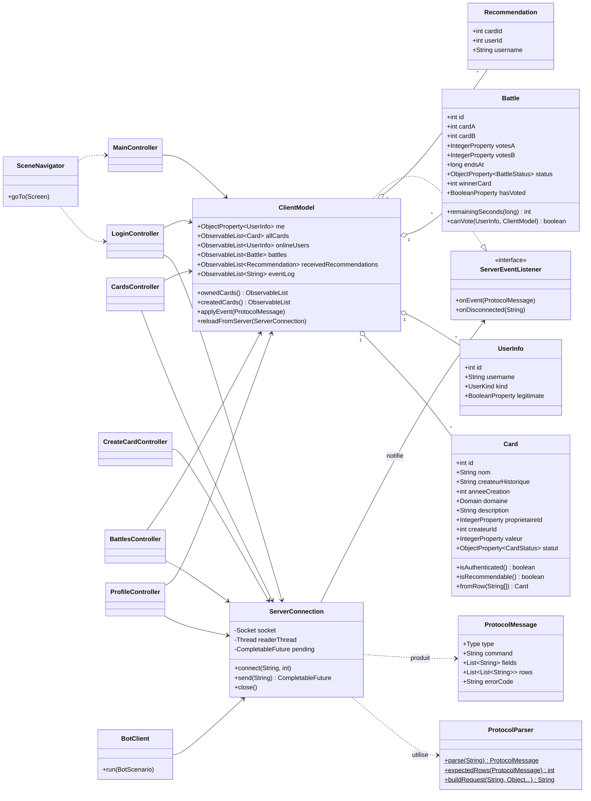
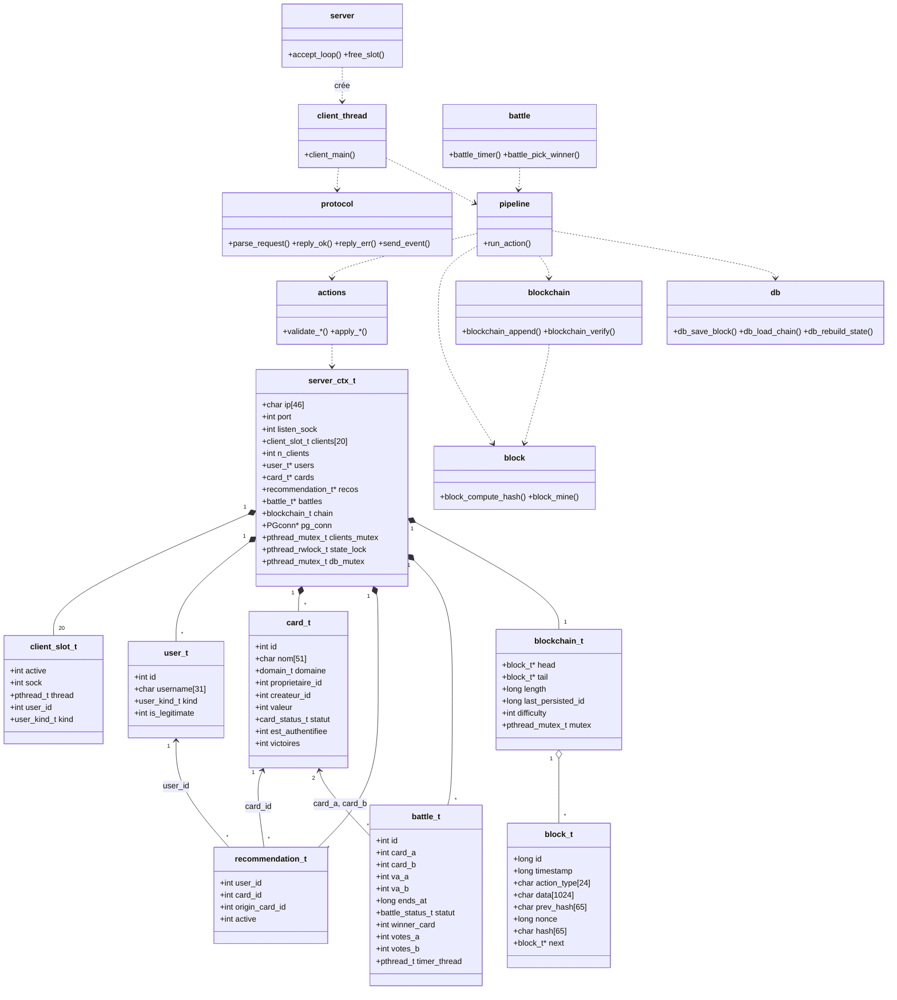

# Annexe C — Diagrammes de classes

Cette annexe donne une vue d'ensemble des données du client (classes Java) et du serveur (structures et modules C). Les attributs détaillés sont dans [donnees-client.md](donnees-client.md), [donnees-serveur.md](donnees-serveur.md) et [structures-blockchain.md](structures-blockchain.md).

Le serveur est écrit en C : il n'a pas de classes au sens strict. Le diagramme serveur représente chaque `struct` comme une classe et chaque module comme une classe sans attribut qui regroupe ses fonctions. Ce choix sert uniquement à lire les dépendances.

## C.1 Classes du client Java (`diagrammes-client/02-diagramme-classes.png`)

<!-- png: diagrammes-client/02-diagramme-classes.png -->

Points de conception :

* `ClientModel` est le seul état partagé. Les contrôleurs le lisent et le modifient, jamais l'un l'autre.
* `ServerConnection` ne connaît pas la vue : elle notifie un `ServerEventListener`, implémenté par `ClientModel`. Le bot réutilise la même connexion sans modèle graphique.
* `ProtocolParser` est statique et sans état : il se teste sans réseau.

## C.2 Structures et modules du serveur C (`diagrammes-serveur/02-classes-serveur.png`)

<!-- png: diagrammes-serveur/02-classes-serveur.png -->

Points de conception :

* `server_ctx_t` regroupe tout l'état global ; les verrous qui le protègent sont dans la même structure.
* `pipeline` est le seul module qui enchaîne validation, minage, ajout et sauvegarde. Les modules `actions`, `block`, `blockchain` et `db` ne connaissent pas cet enchaînement.
* `battle` appelle `pipeline` comme un client : le résultat d'une battle suit exactement le même chemin qu'une action utilisateur.

## C.3 Structure de la blockchain

Le diagramme de classes `00-blockchain.png` (blocs et chaîne) est dans [structures-blockchain.md](structures-blockchain.md) §1. Le schéma relationnel `01-schema-bdd.png` est dans [schema-bdd.md](schema-bdd.md) §2.
