# Annexe D — Diagrammes de séquence

Cette annexe décrit les échanges entre composants pour chaque action. La partie D.1 présente la vue côté client (utilisateur, interface, réseau, serveur) et la partie D.2 la vue côté serveur (threads, validation, blockchain, base). Les deux se complètent : le serveur `S` de la partie D.1 correspond au thread client `CT` de la partie D.2.

Le minage et la vérification, au niveau de l'algorithme, sont dans [structures-blockchain.md](structures-blockchain.md) (diagrammes `02-sequence-minage` et `03-sequence-verification` de `diagrammes-blockchain-bdd/`).

Convention : les noms de commandes et de réponses sont ceux du [protocole](protocole-applicatif-commun.md).

---

## D.1 Séquences côté client

Participants : **U** utilisateur, **V** vue JavaFX, **C** contrôleur, **N** couche réseau (`ServerConnection`), **S** serveur.

### D.1.1 Login (`diagrammes-client/03-sequence-login.png`)

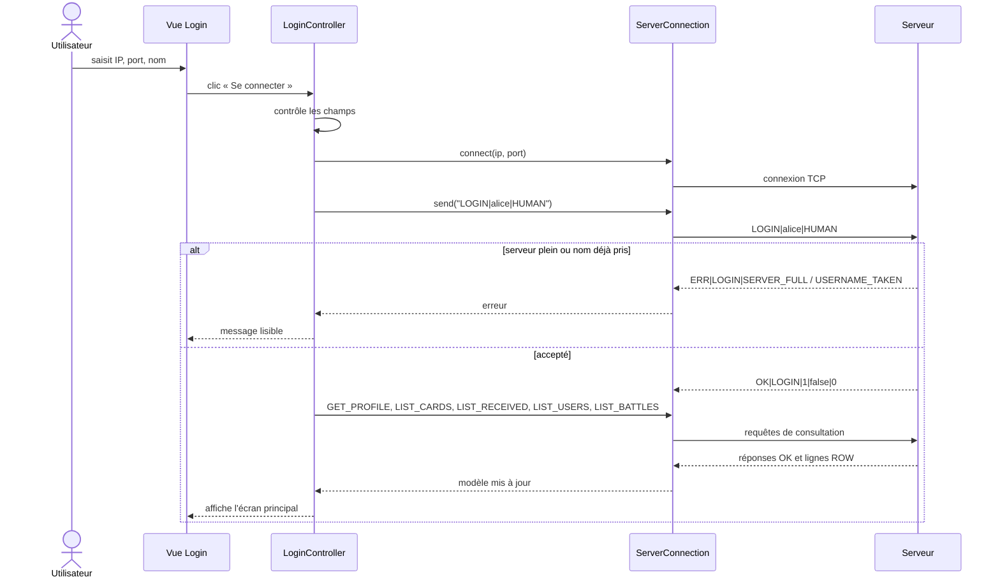

<!-- png: diagrammes-client/03-sequence-login.png -->

### D.1.2 Création de carte (`diagrammes-client/04-sequence-create-card.png`)

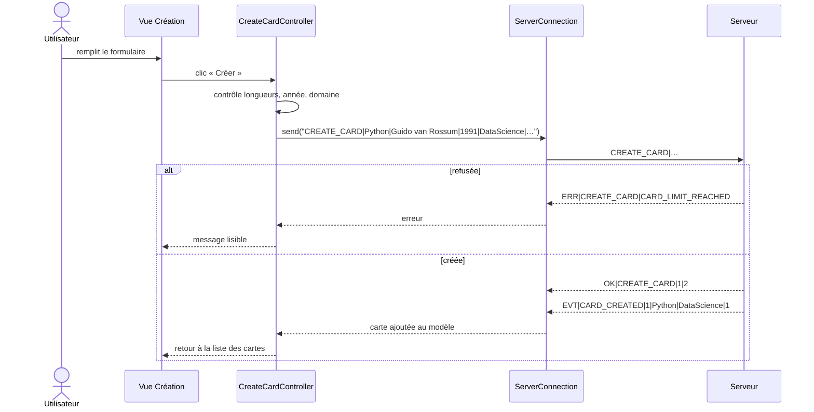

<!-- png: diagrammes-client/04-sequence-create-card.png -->

### D.1.3 Recommandation (`diagrammes-client/05-sequence-recommend.png`)

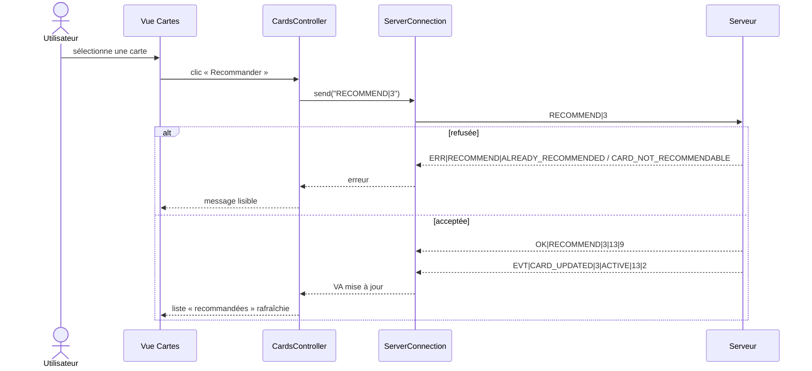

<!-- png: diagrammes-client/05-sequence-recommend.png -->

### D.1.4 Répudiation (`diagrammes-client/06-sequence-repudiate.png`)

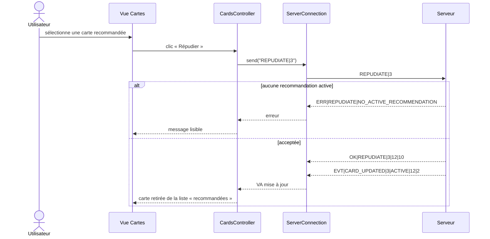

<!-- png: diagrammes-client/06-sequence-repudiate.png -->

### D.1.5 Lancement d'une battle (`diagrammes-client/07-sequence-battle.png`)

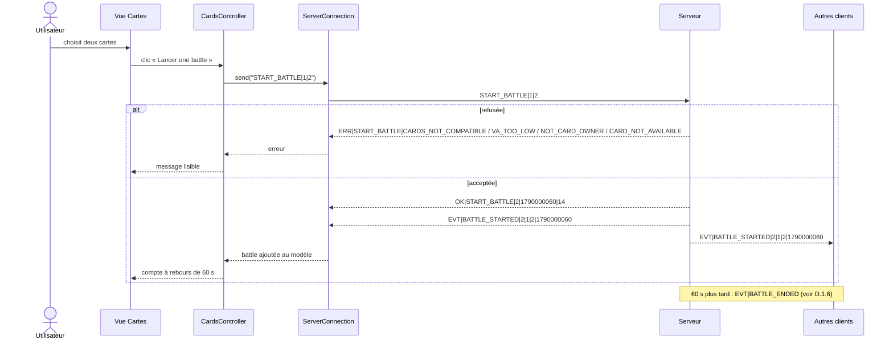

<!-- png: diagrammes-client/07-sequence-battle.png -->

### D.1.6 Vote (`diagrammes-client/08-sequence-vote.png`)

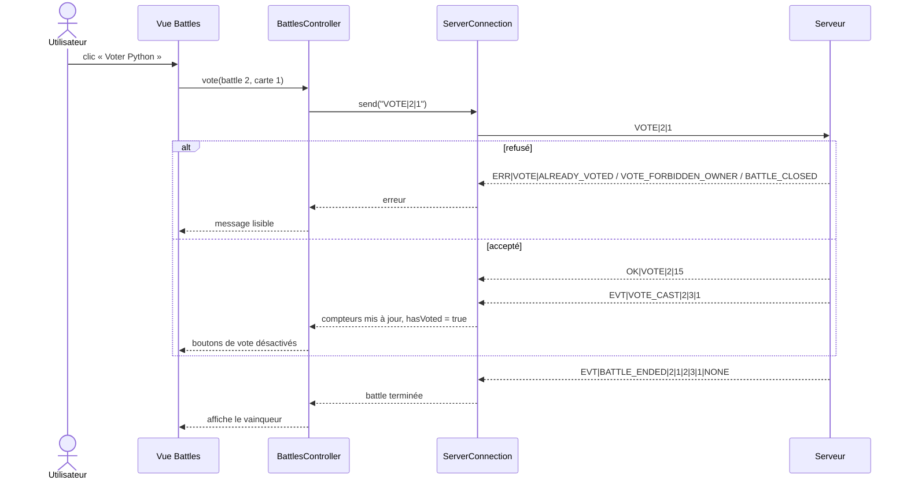

<!-- png: diagrammes-client/08-sequence-vote.png -->

### D.1.7 Légitimation (`diagrammes-client/09-sequence-legitimation.png`)

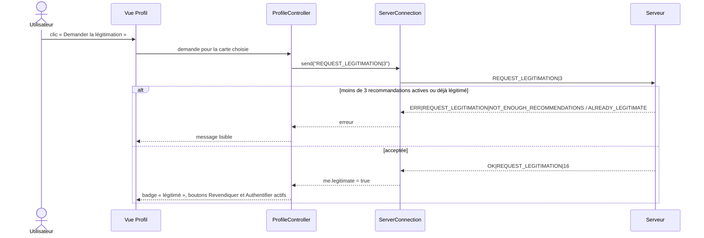

<!-- png: diagrammes-client/09-sequence-legitimation.png -->

### D.1.8 Authentification d'une carte (`diagrammes-client/10-sequence-authentification.png`)

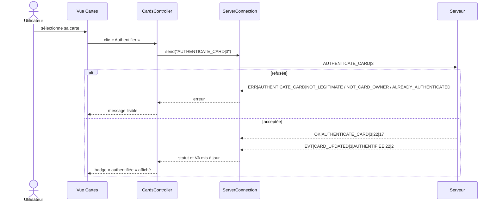

<!-- png: diagrammes-client/10-sequence-authentification.png -->

### D.1.9 Revendication (`diagrammes-client/11-sequence-revendication.png`)

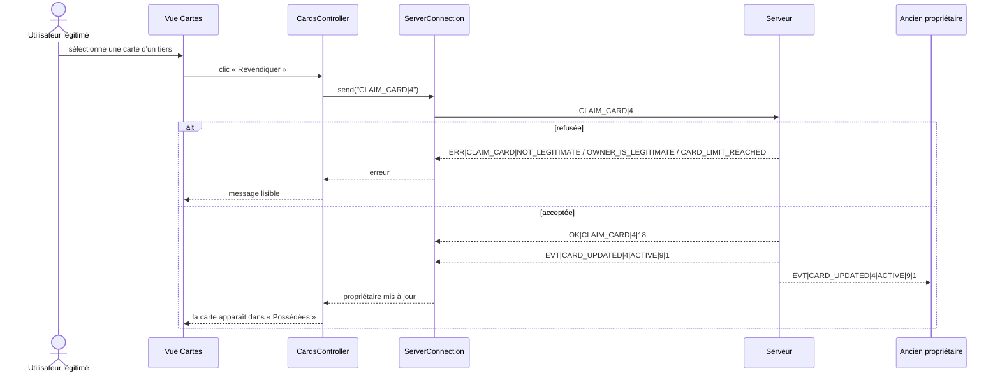

<!-- png: diagrammes-client/11-sequence-revendication.png -->

### D.1.10 Déconnexion (`diagrammes-client/12-sequence-disconnect.png`)

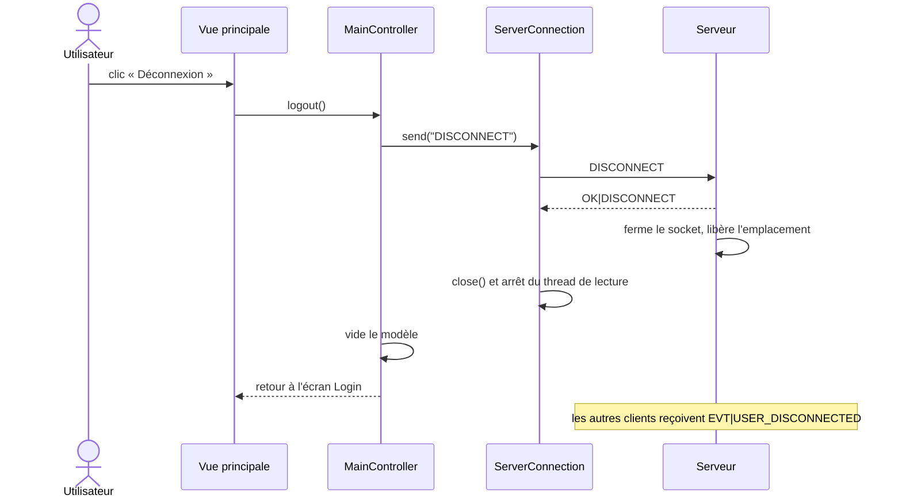

<!-- png: diagrammes-client/12-sequence-disconnect.png -->

---

## D.2 Séquences côté serveur

Participants : **CL** client, **CT** thread client, **P** module `protocol`, **A** module `actions`, **PL** module `pipeline`, **BC** blockchain (`block` et `blockchain`), **ST** état en mémoire, **DB** PostgreSQL.

Les séquences D.2.2 à D.2.9 utilisent toutes le pipeline commun. Pour éviter de le répéter, D.2.2 le détaille en entier et les suivantes montrent ce qui change.

### D.2.1 Login (`diagrammes-serveur/03-sequence-login-serveur.png`)

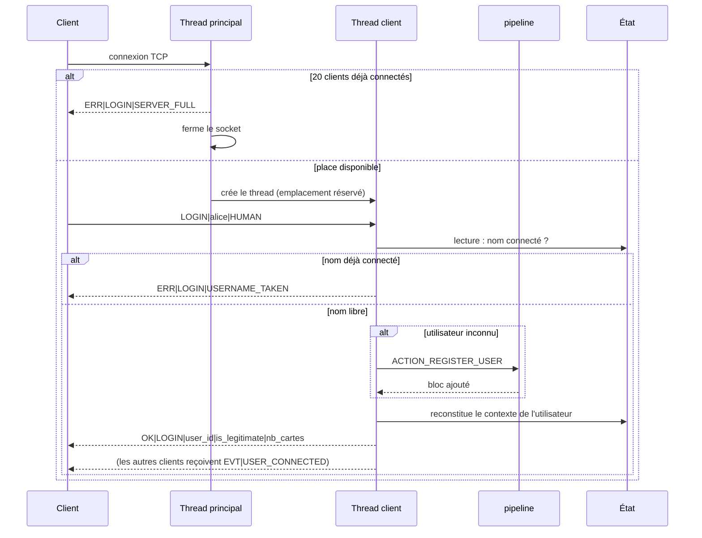

<!-- png: diagrammes-serveur/03-sequence-login-serveur.png -->

### D.2.2 Création de carte, avec le pipeline complet (`diagrammes-serveur/04-sequence-create-card-serveur.png`)

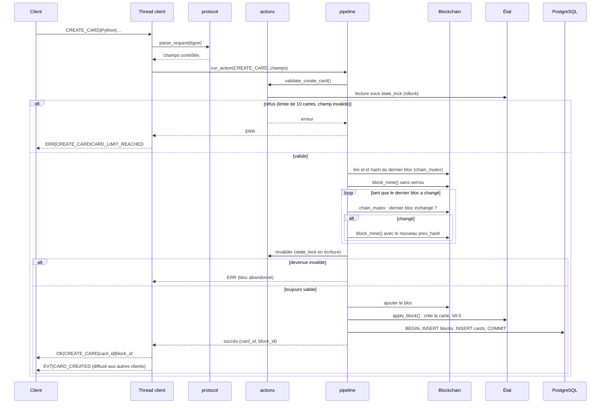

<!-- png: diagrammes-serveur/04-sequence-create-card-serveur.png -->

### D.2.3 Recommandation (`diagrammes-serveur/05-sequence-recommend-serveur.png`)

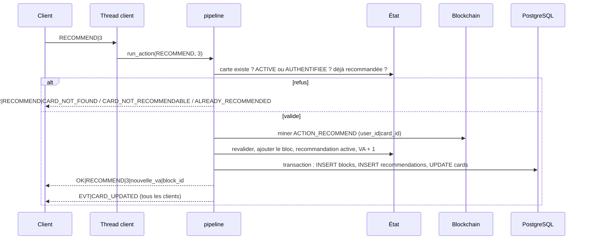

<!-- png: diagrammes-serveur/05-sequence-recommend-serveur.png -->

### D.2.4 Répudiation (`diagrammes-serveur/06-sequence-repudiate-serveur.png`)

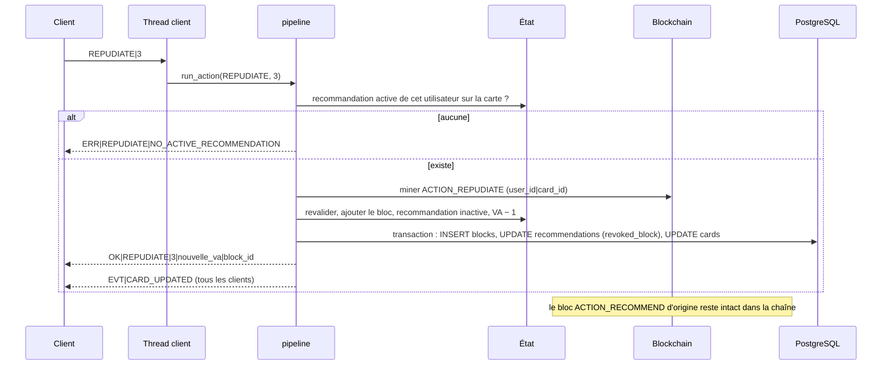

<!-- png: diagrammes-serveur/06-sequence-repudiate-serveur.png -->

### D.2.5 Lancement d'une battle (`diagrammes-serveur/07-sequence-battle-serveur.png`)

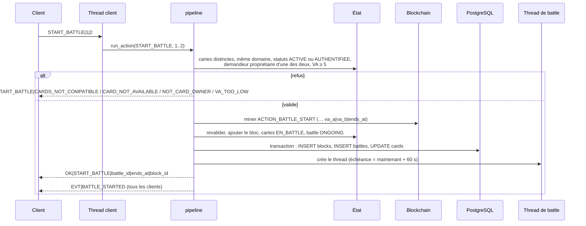

<!-- png: diagrammes-serveur/07-sequence-battle-serveur.png -->

### D.2.6 Vote (`diagrammes-serveur/08-sequence-vote-serveur.png`)

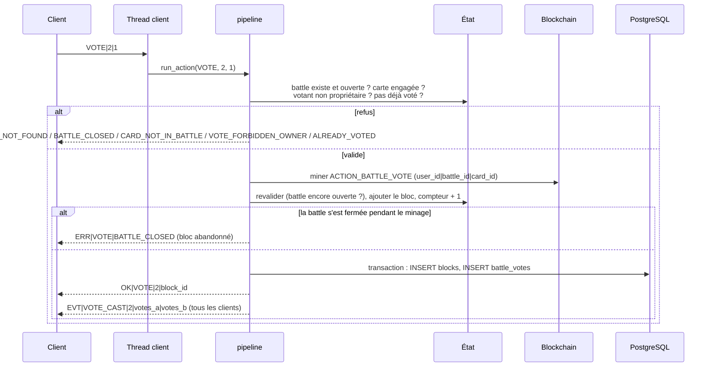

<!-- png: diagrammes-serveur/08-sequence-vote-serveur.png -->

### D.2.7 Résultat d'une battle (`diagrammes-serveur/09-sequence-battle-result-serveur.png`)

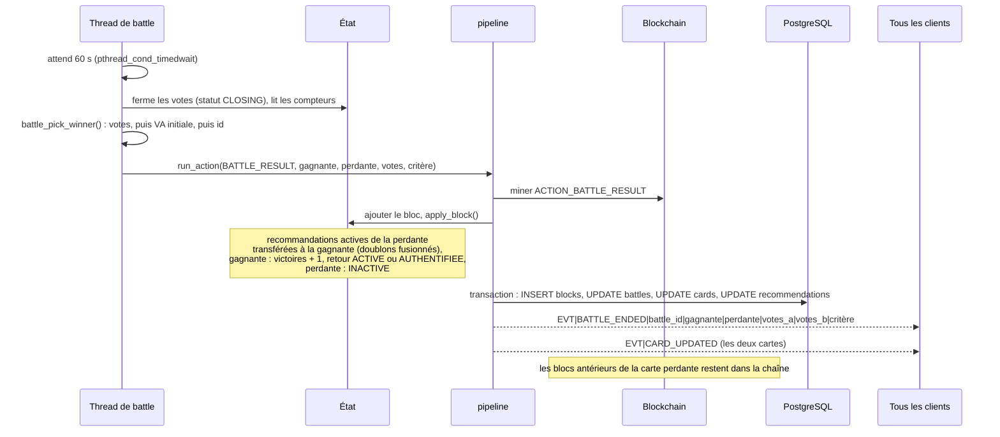

<!-- png: diagrammes-serveur/09-sequence-battle-result-serveur.png -->

### D.2.8 Légitimation (`diagrammes-serveur/10-sequence-legitimation-serveur.png`)

La revendication (`CLAIM_CARD`) suit le même enchaînement, avec ses propres validations (voir [cas-erreur.md](cas-erreur.md) §3.3) et un bloc `ACTION_CLAIM_CARD`.

```mermaid
sequenceDiagram
    participant CL as Client
    participant CT as Thread client
    participant PL as pipeline
    participant ST as État
    participant BC as Blockchain
    participant DB as PostgreSQL
    CL->>CT: REQUEST_LEGITIMATION|3
    CT->>PL: run_action(LEGITIMATION, 3)
    PL->>ST: déjà légitimé ? au moins 3 recommandations actives ?
    alt refus
        PL-->>CL: ERR|REQUEST_LEGITIMATION|ALREADY_LEGITIMATE / NOT_ENOUGH_RECOMMENDATIONS
    else valide
        PL->>BC: miner ACTION_LEGITIMATION (user_id|card_id)
        PL->>ST: revalider, ajouter le bloc, is_legitimate = 1
        PL->>DB: transaction : INSERT blocks, UPDATE users
        PL-->>CL: OK|REQUEST_LEGITIMATION|block_id
    end
```

<!-- png: diagrammes-serveur/10-sequence-legitimation-serveur.png -->

### D.2.9 Authentification (`diagrammes-serveur/11-sequence-authentification-serveur.png`)

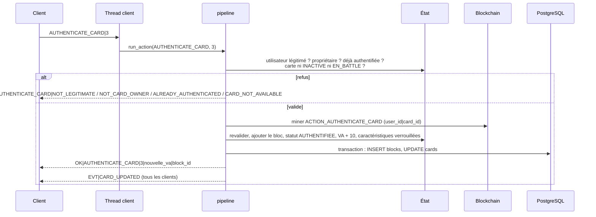

<!-- png: diagrammes-serveur/11-sequence-authentification-serveur.png -->

### D.2.10 Déconnexion (`diagrammes-serveur/12-sequence-disconnect-serveur.png`)

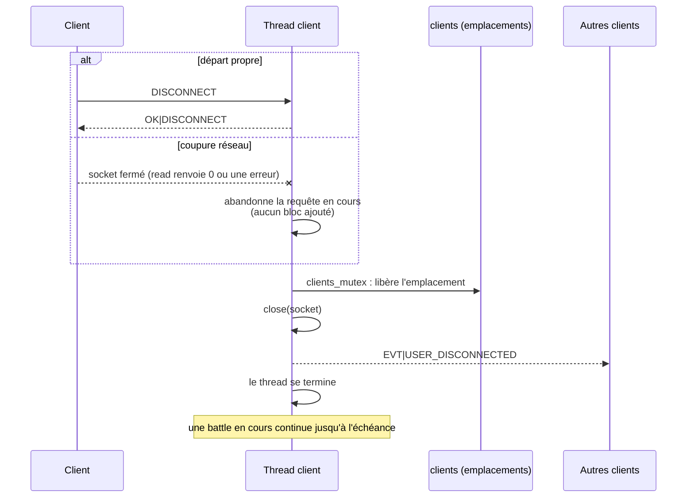

<!-- png: diagrammes-serveur/12-sequence-disconnect-serveur.png -->

### D.2.11 Minage dans le serveur (`diagrammes-serveur/13-sequence-minage-serveur.png`)

Cette séquence détaille la partie « minage optimiste » du pipeline : elle montre pourquoi le calcul ne bloque pas les autres clients.

```mermaid
sequenceDiagram
    participant T1 as Thread client 1
    participant T2 as Thread client 2
    participant BC as Blockchain (chain_mutex)
    T1->>BC: lire dernier bloc (id 7, hash H7)
    T2->>BC: lire dernier bloc (id 7, hash H7)
    par minage sans verrou
        T1->>T1: miner le bloc 8 avec prev = H7
    and
        T2->>T2: miner le bloc 8 avec prev = H7
    end
    T1->>BC: dernier bloc toujours H7 ?
    BC-->>T1: oui : bloc 8 ajouté (hash H8)
    T2->>BC: dernier bloc toujours H7 ?
    BC-->>T2: non (maintenant H8)
    T2->>T2: remine le bloc 9 avec prev = H8
    T2->>BC: dernier bloc toujours H8 ?
    BC-->>T2: oui : bloc 9 ajouté
```

<!-- png: diagrammes-serveur/13-sequence-minage-serveur.png -->

### D.2.12 Vérification dans le serveur (`diagrammes-serveur/14-sequence-verification-serveur.png`)

```mermaid
sequenceDiagram
    participant CL as Client ou console
    participant CT as Thread
    participant BC as Blockchain
    participant V as blockchain_verify
    CL->>CT: VERIFY_CHAIN (ou « verify » sur la console)
    CT->>BC: chain_mutex : fige la chaîne pendant la lecture
    CT->>V: blockchain_verify()
    loop pour chaque bloc
        V->>V: block_compute_hash() et comparaison
        V->>V: prev_hash égal au hash précédent ?
        V->>V: hash commence par 000 ?
    end
    alt anomalie
        V-->>CT: INVALID(block_id, BAD_HASH / BAD_PREV_HASH / BAD_POW)
        CT-->>CL: OK|VERIFY_CHAIN|INVALID|block_id|raison
    else chaîne intègre
        V-->>CT: VALID(nb_blocs)
        CT-->>CL: OK|VERIFY_CHAIN|VALID|nb_blocs
    end
```

<!-- png: diagrammes-serveur/14-sequence-verification-serveur.png -->

> Pendant la vérification, `chain_mutex` est tenu : les ajouts de blocs attendent. La vérification d'une chaîne de quelques milliers de blocs dure quelques millisecondes (un SHA-256 par bloc), donc cette pause reste négligeable.
