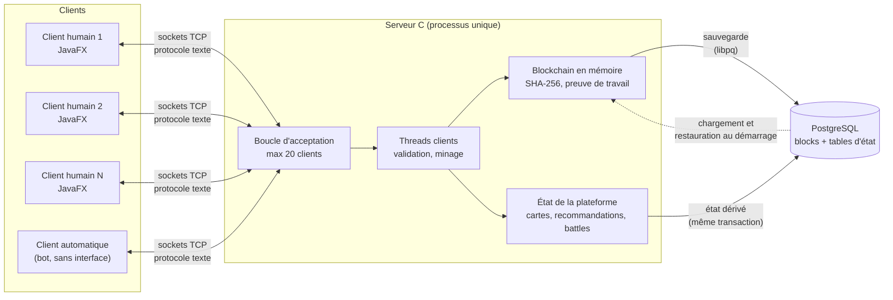
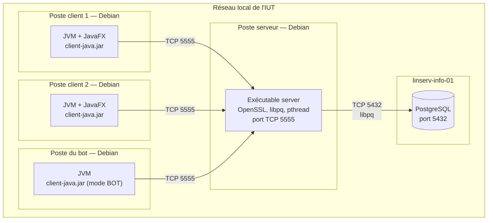

# Annexe E — Déploiement et architecture globale

Cette annexe montre la couche physique du système : où s'exécute chaque programme et comment ils communiquent.

## E.1 Architecture globale (`diagrammes-generaux/00-architecture-globale.png`)



<!-- png: diagrammes-generaux/00-architecture-globale.png -->

Les clients ne parlent qu'au serveur. Seul le serveur accède à PostgreSQL.

## E.2 Diagramme de déploiement (`diagrammes-generaux/04-deploiement.png`)



<!-- png: diagrammes-generaux/04-deploiement.png -->

## E.3 Noeuds et artefacts

| Noeud | Artefact | Dépendances | Port |
| :--- | :--- | :--- | :--- |
| Poste client | `client-java.jar` | Java 17 ou plus, JavaFX | aucun port d'écoute |
| Poste du bot | `client-java.jar` en mode `BOT` | Java, sans JavaFX | aucun port d'écoute |
| Poste serveur | `server` | `libssl`, `libpq`, `pthread` | TCP 5555 (modifiable) |
| `linserv-info-01` | Base PostgreSQL | PostgreSQL | TCP 5432 |

Le serveur et un client peuvent tourner sur la même machine pendant les développements et la démonstration.

## E.4 Paramètres de configuration

| Paramètre | Où | Valeur par défaut |
| :--- | :--- | :--- |
| Adresse d'écoute | Serveur, ligne de commande ou fichier de configuration | `0.0.0.0` |
| Port d'écoute | Serveur | `5555` |
| Hôte de la base | Fichier de configuration du serveur | `linserv-info-01` |
| Utilisateur et mot de passe de la base | Fichier de configuration local, exclu du dépôt | — |
| Difficulté de minage | Constante de compilation | `3` |
| Adresse et port du serveur | Écran de login du client | dernière valeur saisie |

## E.5 Lancement (prévu pour la phase 2)

```bash
# Serveur
cd phase2/server-c
make
./server --port 5555 --config config.local.ini

# Client
cd phase2/client-java
./gradlew run          # ou mvn javafx:run, selon l'outil retenu

# Bot
java -jar client-java.jar --bot --host 127.0.0.1 --port 5555 --name bot-1
```

Les commandes exactes seront fixées avec le code, puis documentées dans le README de `phase2/`.

## E.6 Contraintes réseau

* Les postes de l'IUT atteignent `linserv-info-01` depuis le LAN. Hors du LAN, la base n'est pas joignable : le serveur démarre alors en mode dégradé (voir [cas-erreur.md](cas-erreur.md) §4).
* Le port 5555 doit être autorisé entre les postes clients et le poste serveur. Sur un même poste, `127.0.0.1` suffit.
* Aucun chiffrement du canal (TLS) n'est prévu : la plateforme est un projet pédagogique sur un réseau local et la sécurité repose sur la blockchain pour l'intégrité, pas sur la confidentialité.
