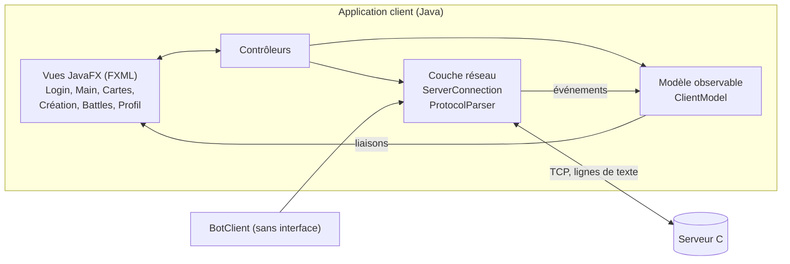
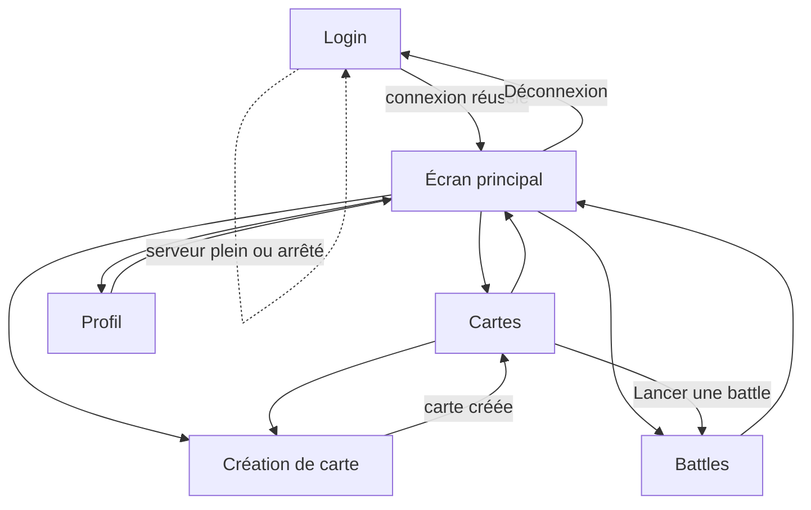

# Architecture du client

Responsables : Usman, Omar. Le client est une application Java avec une interface JavaFX. Il communique avec le serveur uniquement par socket TCP selon le [protocole applicatif](protocole-applicatif-commun.md).

## 1. Choix techniques

| Question | Choix | Justification |
| :--- | :--- | :--- |
| Interface | JavaFX avec fichiers FXML | Imposé. Le FXML sépare la mise en page du code. |
| Structure | MVC : modèle observable, vues FXML, contrôleurs | Les vues se mettent à jour automatiquement quand le modèle change. |
| Réseau | `java.net.Socket` avec un thread de lecture dédié | Le thread JavaFX ne doit jamais attendre le réseau. |
| Requêtes | Une requête en cours à la fois, réponse rendue par `CompletableFuture` | Correspond au protocole : une réponse par requête. |
| Mise à jour de l'interface | `Platform.runLater` depuis le thread réseau | Seul le thread JavaFX peut modifier l'interface. |
| Tests | JUnit sur l'analyseur de protocole, le modèle et un faux serveur local | Aucune dépendance à l'interface graphique pour tester. |
| Client automatique | Même couche réseau, sans interface, `kind = BOT` | Réutilise le code, actions distinguables par le serveur. |

## 2. Vue d'ensemble



<!-- png: diagrammes-client/00-architecture-client.png -->
*Diagramme `00-architecture-client.png`.*

## 3. Packages

Package racine : `fr.iut.saerecommender.client`.

| Package | Contenu | Rôle |
| :--- | :--- | :--- |
| `app` | `MainApp`, `SceneNavigator` | Démarrage JavaFX, changement d'écran |
| `network` | `ServerConnection`, `ProtocolParser`, `ProtocolMessage`, `ServerEventListener`, `ErrorCode` | Socket, lecture, analyse, envoi |
| `model` | `ClientModel`, `Card`, `UserInfo`, `Battle`, `Domain`, `CardStatus`, `Recommendation` | Données affichées |
| `controller` | `LoginController`, `MainController`, `CardsController`, `CreateCardController`, `BattlesController`, `ProfileController` | Logique de chaque écran |
| `bot` | `BotClient`, `BotScenario` | Client automatique |

Les ressources FXML sont dans `src/main/resources/fxml/`.

## 4. Gestion des threads

| Thread | Rôle |
| :--- | :--- |
| JavaFX Application Thread | Affichage et événements de l'utilisateur. N'attend jamais le réseau. |
| Lecture réseau (démon) | Lit les lignes du socket, assemble les réponses de liste, complète le `CompletableFuture` en attente ou transmet les événements `EVT` |
| Minuteur d'interface | `Timeline` JavaFX qui fait descendre le compte à rebours des battles |

Principe d'une requête :

1. Le contrôleur appelle `connection.send("RECOMMEND|3")`, qui renvoie un `CompletableFuture<ProtocolMessage>`.
2. La ligne part sur le socket. Le contrôleur n'attend pas : il affiche un indicateur d'attente.
3. Le thread de lecture reçoit `OK|…` ou `ERR|…` et complète le future.
4. Le contrôleur traite la réponse dans `thenAccept`, via `Platform.runLater`, et met à jour le modèle.
5. Les lignes `EVT|…` reçues à tout moment mettent à jour le modèle directement.

Si le serveur ne répond pas dans un délai de 10 secondes, le future échoue et l'interface affiche une erreur de connexion.

## 5. Navigation



<!-- png: diagrammes-client/13-navigation-javafx.png -->
*Diagramme `13-navigation-javafx.png`. Une version générale est dans `diagrammes-generaux/02-navigation-javafx.png` (voir [annexe A](annexe-a-parcours-utilisateur.md)).*

`SceneNavigator` garde une seule `Stage` et remplace la scène à chaque navigation. Le modèle et la connexion survivent aux changements d'écran.

## 6. Événements reconnus

| Événement serveur | Réaction du client |
| :--- | :--- |
| `USER_CONNECTED`, `USER_DISCONNECTED` | Met à jour la liste des utilisateurs connectés |
| `CARD_CREATED` | Ajoute la carte à la liste générale |
| `CARD_UPDATED` | Met à jour VA, statut et propriétaire. Le badge « authentifiée » apparaît si le statut est `AUTHENTIFIEE`. |
| `BATTLE_STARTED` | Ajoute une battle en cours avec son compte à rebours |
| `VOTE_CAST` | Met à jour les compteurs de votes |
| `BATTLE_ENDED` | Clôt la battle, affiche le vainqueur et le critère de départage |
| `SERVER_SHUTDOWN` | Affiche un message et revient à l'écran de connexion |

## 7. Messages d'erreur affichés

Le client n'affiche jamais le code brut. Chaque code du protocole correspond à un message lisible :

| Code | Message affiché |
| :--- | :--- |
| `SERVER_FULL` | Le serveur est plein (20 utilisateurs). Réessayez plus tard. |
| `USERNAME_TAKEN` | Ce nom est déjà utilisé par un utilisateur connecté. |
| `INVALID_FIELD`, `INVALID_DOMAIN` | Un champ est incorrect. Vérifiez le formulaire. |
| `CARD_LIMIT_REACHED` | Vous possédez déjà 10 cartes actives. |
| `CARD_NOT_RECOMMENDABLE` | Cette carte ne peut pas être recommandée en ce moment. |
| `ALREADY_RECOMMENDED` | Vous recommandez déjà cette carte. |
| `NO_ACTIVE_RECOMMENDATION` | Vous ne recommandez pas cette carte. |
| `CARDS_NOT_COMPATIBLE` | Les deux cartes doivent appartenir au même domaine. |
| `CARD_NOT_AVAILABLE` | Cette carte n'est pas disponible (inactive ou déjà en battle). |
| `NOT_CARD_OWNER` | Vous devez posséder au moins une des deux cartes (ou la carte concernée). |
| `VA_TOO_LOW` | Chaque carte doit avoir une valeur d'au moins 5. |
| `BATTLE_CLOSED` | Le vote est terminé. |
| `VOTE_FORBIDDEN_OWNER` | Les propriétaires des cartes ne peuvent pas voter. |
| `ALREADY_VOTED` | Vous avez déjà voté dans cette battle. |
| `NOT_ENOUGH_RECOMMENDATIONS` | Il faut au moins 3 recommandations actives pour être légitimé. |
| `NOT_LEGITIMATE` | Cette action est réservée aux utilisateurs légitimés. |
| `OWNER_IS_LEGITIMATE` | Le propriétaire de cette carte est déjà légitimé. |
| `ALREADY_AUTHENTICATED` | Cette carte est déjà authentifiée. |
| Autres codes | Une erreur est survenue (le message du serveur est affiché). |

Le client contrôle aussi les champs avant l'envoi (longueurs, année numérique, domaine choisi dans une liste) pour éviter des allers-retours inutiles. Le serveur reste l'autorité : il revalide tout.

## 8. Maquettes

Les maquettes montrent l'organisation de chaque écran. Elles seront reprises en images dans `diagrammes-client/14` à `19` si l'équipe souhaite des versions graphiques ; la version texte ci-dessous fait référence en attendant.

### 8.1 Login (`14-maquette-login`)

```text
┌──────────────────────────────────────────────┐
│            SAÉ Recommender                   │
│                                              │
│   Adresse du serveur   [ 192.168.1.10     ]  │
│   Port                 [ 5555             ]  │
│   Nom d'utilisateur    [ alice            ]  │
│                                              │
│                [  Se connecter  ]            │
│                                              │
│   Statut : prêt                              │
└──────────────────────────────────────────────┘
```

### 8.2 Écran principal (`15-maquette-main`)

```text
┌──────────────────────────────────────────────────────────────┐
│ SAÉ Recommender — alice (légitimé)          [Déconnexion]    │
├───────────────┬──────────────────────────────────────────────┤
│  Menu         │  Utilisateurs connectés (3)                  │
│  > Cartes     │   alice   HUMAN  ★                           │
│  > Créer      │   bob     HUMAN                              │
│  > Battles    │   bot-1   BOT                                │
│  > Profil     ├──────────────────────────────────────────────┤
│               │  Journal des événements                      │
│               │   14:02 bob a créé « Rust »                  │
│               │   14:03 Battle #2 lancée : Python / R        │
└───────────────┴──────────────────────────────────────────────┘
```

### 8.3 Cartes (`16-maquette-cards`)

```text
┌──────────────────────────────────────────────────────────────┐
│ Cartes   [Toutes][Possédées][Créées][Recommandées]           │
├──────────────────────────────────────────────────────────────┤
│ #  Nom      Domaine      Statut         VA   Propriétaire    │
│ 1  Python   DataScience  ACTIVE         12   alice           │
│ 2  Rust     Systems      AUTHENTIFIEE ✔ 20   bob             │
│ 3  R        DataScience  EN_BATTLE       8   carol           │
├──────────────────────────────────────────────────────────────┤
│ Détail : Rust — Graydon Hoare, 2010 — Langage système sûr    │
│ [Recommander] [Répudier] [Revendiquer] [Authentifier]        │
│ [Lancer une battle…]                                         │
└──────────────────────────────────────────────────────────────┘
```

### 8.4 Création de carte (`17-maquette-create-card`)

```text
┌──────────────────────────────────────────────┐
│ Créer une carte                              │
│  Nom                  [ Python           ]   │
│  Créateur historique  [ Guido van Rossum ]   │
│  Année de création    [ 1991             ]   │
│  Domaine              [ DataScience   ▼  ]   │
│  Description          [                  ]   │
│                       [                  ]   │
│          [ Annuler ]      [ Créer ]          │
└──────────────────────────────────────────────┘
```

### 8.5 Battles (`18-maquette-battles`)

```text
┌──────────────────────────────────────────────────────────────┐
│ Battles en cours                                             │
│  #2  Python (12)  ⚔  R (8)        reste 00:42                │
│      Votes : 3 — 1        [ Voter Python ] [ Voter R ]       │
├──────────────────────────────────────────────────────────────┤
│ Battles terminées                                            │
│  #1  Rust ⚔ Go — gagnante : Rust (5-2)                       │
└──────────────────────────────────────────────────────────────┘
```

Les boutons de vote sont désactivés pour les propriétaires des cartes engagées et après un vote.

### 8.6 Profil (`19-maquette-profile`)

```text
┌──────────────────────────────────────────────┐
│ Profil — alice                               │
│  Statut : légitimé ★                         │
│  Cartes actives : 3 / 10                     │
│  Recommandations données : 5                 │
│  VA totale de mes cartes : 31                │
│                                              │
│  Recommandations reçues par mes cartes :     │
│   Python ← bob, carol                        │
│                                              │
│  [Demander la légitimation]                  │
│  [Vérifier la blockchain]                    │
└──────────────────────────────────────────────┘
```

## 9. Client automatique (bot)

Le bot réutilise `ServerConnection` mais n'ouvre aucune fenêtre. Il se connecte avec `LOGIN|<nom>|BOT`, ce qui permet au serveur et aux autres utilisateurs de le distinguer d'un humain (`kind` visible dans la liste des utilisateurs et dans la blockchain).

Pour ne pas fausser la valeur des cartes, le bot ne recommande jamais. Il se limite à :

* créer quelques cartes de test (`BotScenario.SEED`) ;
* voter dans les battles en cours (`BotScenario.VOTER`), au hasard ;
* se déconnecter proprement.

## 10. Tests prévus

| Cible | Type de test |
| :--- | :--- |
| `ProtocolParser` | Découpage, réponses de liste, lignes mal formées |
| `ClientModel` | Application des événements, cohérence des listes |
| `ServerConnection` | Faux serveur local (`ServerSocket`) : envoi, réponse, événement intercalé, coupure |
| Validation des formulaires | Valeurs limites (50, 100, 500 caractères, année) |

## 11. Données du client

Les classes et leurs attributs sont décrits dans [donnees-client.md](donnees-client.md). Le diagramme de classes est dans l'[annexe C](annexe-c-classes.md).
