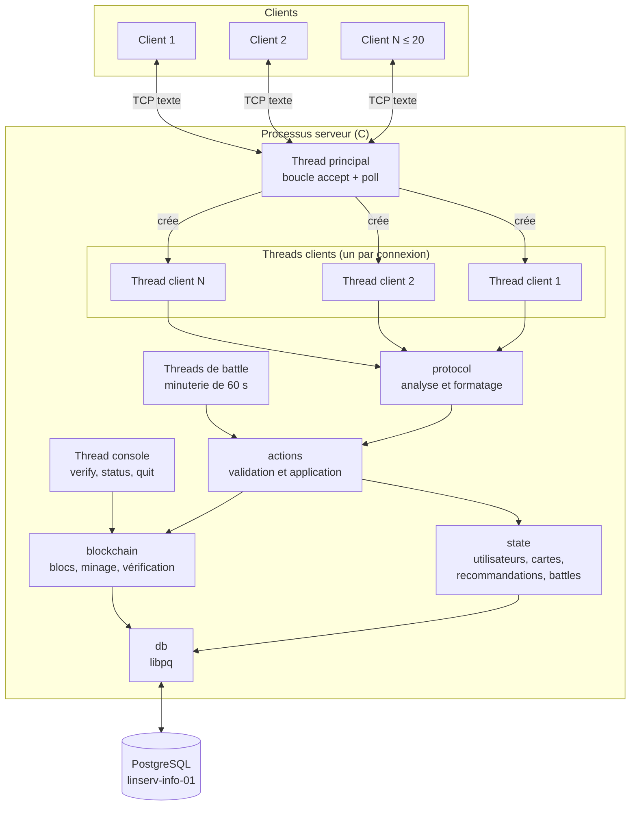
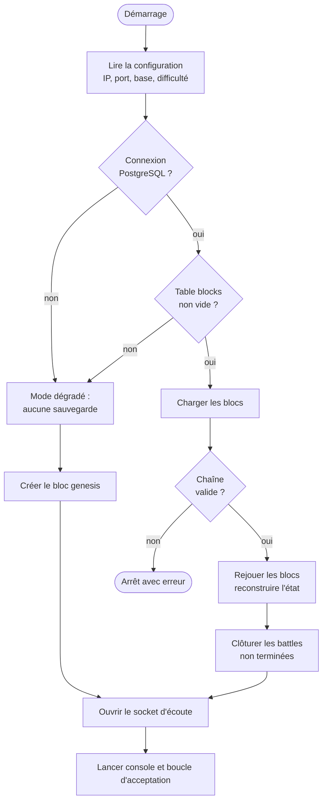

# Architecture du serveur

Responsables : Mai, Albine. Le serveur est un programme C unique, lancé sous Debian, qui accepte plusieurs clients par sockets TCP, valide leurs demandes, les inscrit dans la blockchain et les sauvegarde dans PostgreSQL.

## 1. Choix techniques

| Question | Choix | Justification |
| :--- | :--- | :--- |
| Multitâche | **Threads POSIX** (`pthread`), un thread par client | Les threads partagent l'état en mémoire (cartes, blockchain), ce qui est naturel ici. Les processus (`fork`) demanderaient de la mémoire partagée et des sémaphores entre processus. |
| Modèle de threads | Un thread par client connecté, plafonné à 20 | Simple, borné par `MAX_CLIENTS`, le minage d'un client ne bloque pas les autres. |
| Attente de connexions | `poll()` avec délai de 500 ms dans la boucle d'acceptation | Permet de tester le drapeau d'arrêt sans bloquer indéfiniment sur `accept()`. |
| Protocole | Lignes de texte | Voir [protocole-applicatif-commun.md](protocole-applicatif-commun.md). |
| Hachage | SHA-256 via OpenSSL | Imposé et autorisé. |
| Base de données | `libpq`, une connexion protégée par un verrou | Les écritures sont déjà sérialisées par le verrou de la chaîne. |
| Arrêt | Drapeau `volatile sig_atomic_t` mis par `SIGINT`/`SIGTERM` | Seule opération sûre dans un gestionnaire de signal. |

## 2. Vue d'ensemble



<!-- png: diagrammes-serveur/01-architecture-serveur.png -->
*Diagramme `01-architecture-serveur.png`. Le diagramme de cas d'utilisation du serveur (`00-cas-utilisation-serveur.png`) est dans l'[annexe B](annexe-b-cas-utilisation.md).*

## 3. Modules

Chaque module correspond à un couple `.c` / `.h` dans `phase2/server-c/src/`.

| Module | Responsabilité |
| :--- | :--- |
| `main` | Lecture de la configuration, démarrage, orchestration de l'arrêt |
| `config` | Adresse IP, port, paramètres de connexion à la base, difficulté |
| `server` | Socket d'écoute, boucle d'acceptation, limite `MAX_CLIENTS`, table des emplacements clients |
| `client_thread` | Boucle d'un thread client : lecture d'une ligne, appel du protocole, envoi de la réponse |
| `protocol` | Découpage des lignes en champs, formatage des réponses `OK`, `ERR`, `EVT`, `ROW` |
| `actions` | Une fonction de validation et une fonction d'application par action |
| `pipeline` | Enchaînement commun : validation, minage optimiste, revalidation, ajout, sauvegarde, notification |
| `state` | Utilisateurs, cartes, recommandations, battles en mémoire et leurs verrous |
| `block` | Structure d'un bloc, calcul du hash (`block_compute_hash`), minage (`block_mine`) |
| `blockchain` | Liste chaînée, ajout, vérification (`blockchain_verify`), chargement |
| `battle` | Minuterie de battle, calcul du vainqueur, transfert des recommandations |
| `db` | Connexion PostgreSQL, sauvegarde d'un bloc et de l'état dans une transaction, chargement, reconstruction |
| `console` | Commandes locales de l'administrateur |
| `log` | Journal horodaté sur la sortie standard |

## 4. Threads et synchronisation

### 4.1 Threads

| Thread | Nombre | Rôle |
| :--- | :--- | :--- |
| Principal | 1 | Initialise, accepte les connexions, crée un thread par client accepté |
| Client | 0 à 20 | Lit les requêtes de son client, exécute les actions, répond |
| Battle | 0 à n | Attend la fin des 60 secondes d'une battle, puis applique le résultat |
| Console | 1 | Lit l'entrée standard (`verify`, `status`, `quit`) |

Le nombre de threads est vérifiable pendant la démonstration : `status` affiche le nombre de threads clients actifs, et `ps -L -p <pid>` liste tous les threads du processus.

### 4.2 Verrous

| Verrou | Type | Protège | Tenu pendant |
| :--- | :--- | :--- | :--- |
| `clients_mutex` | mutex | Table des emplacements clients, compteur de connexions | Attribution ou libération d'un emplacement, diffusion d'événements |
| `chain_mutex` | mutex | Liste chaînée, dernier bloc, **section de validation d'un bloc** | Lecture du dernier bloc (très court), puis l'ajout complet d'un bloc (court) |
| `state_lock` | `pthread_rwlock_t` | Utilisateurs, cartes, recommandations, battles | Lecture : validation et consultation. Écriture : application d'un bloc. |
| `db_mutex` | mutex | La connexion `PGconn` | Une transaction |

**Ordre d'acquisition** (jamais dans l'autre sens, pour éviter les interblocages) :
`clients_mutex` → `chain_mutex` → `state_lock` → `db_mutex`.

Le minage, seule étape longue, s'exécute sans aucun de ces verrous.

## 5. Traitement d'une action

Toutes les actions qui modifient la plateforme (`CREATE_CARD`, `RECOMMEND`, `REPUDIATE`, `START_BATTLE`, `VOTE`, `REQUEST_LEGITIMATION`, `CLAIM_CARD`, `AUTHENTICATE_CARD`, ainsi que le résultat d'une battle) suivent le même enchaînement, implémenté une seule fois dans `pipeline`.

1. **Analyse** : le thread découpe la ligne et contrôle les champs (types, longueurs, caractères interdits).
2. **Validation préalable** : sous `state_lock` en lecture, la fonction de validation de l'action applique les règles métier. En cas de refus, le thread répond `ERR` et s'arrête là. Rien n'est écrit.
3. **Construction du bloc** : le thread lit sous `chain_mutex` l'`id` et le `hash` du dernier bloc, puis construit le champ `data`.
4. **Minage** : `block_mine` cherche le nonce, **sans verrou**.
5. **Ajout** : le thread prend `chain_mutex`.
   * Si le dernier bloc a changé, il libère le verrou et retourne à l'étape 3 (nouveau hash précédent).
   * Sinon, il **revalide** l'action sous `state_lock` en écriture, car l'état a pu changer pendant le minage. Si l'action n'est plus valide, il répond `ERR` et le bloc est abandonné.
   * Si elle est valide, il ajoute le bloc, applique l'action à l'état (`apply_block`), puis sauvegarde le bloc et l'état en base dans une transaction.
6. **Réponse** : `OK` au demandeur, puis événements `EVT` aux clients concernés.

Ce schéma garantit trois propriétés :

* un calcul de preuve de travail ne bloque jamais les autres clients ;
* l'ordre des blocs est identique à l'ordre d'application sur l'état ;
* une action refusée n'est jamais inscrite dans la blockchain.

Son coût est qu'un minage peut être recommencé si deux clients ajoutent un bloc au même moment. Avec une difficulté de 3 et 20 clients, ce cas reste rare et coûte quelques millisecondes.

Les séquences détaillées sont dans l'[annexe D](annexe-d-sequences.md).

## 6. Battles

* `START_BATTLE` suit le pipeline ci-dessus (bloc `ACTION_BATTLE_START`). Une fois le bloc ajouté, les deux cartes passent à `EN_BATTLE` et le serveur crée un **thread de battle**.
* Ce thread attend 60 secondes avec `pthread_cond_timedwait`. Un arrêt du serveur le réveille avant l'échéance.
* `VOTE` suit le pipeline (bloc `ACTION_BATTLE_VOTE`). Au moment de la revalidation, le serveur vérifie que la battle est encore ouverte : un vote qui arrive après l'échéance est refusé avec `BATTLE_CLOSED`.
* À l'échéance, le thread de battle ferme les votes sous `state_lock`, calcule le vainqueur selon les règles de départage, puis suit le pipeline avec un bloc `ACTION_BATTLE_RESULT`. L'application de ce bloc transfère les recommandations actives au vainqueur et met la perdante à `INACTIVE`.
* Les déconnexions n'affectent pas la battle : le vote reste ouvert jusqu'à l'échéance.

## 7. Démarrage



Si la base est indisponible ou en erreur, le serveur considère qu'aucun contexte de sauvegarde n'existe, conformément au cahier des charges.

## 8. Arrêt propre

1. `SIGINT`, `SIGTERM` ou la commande console `quit` met le drapeau d'arrêt à 1.
2. La boucle d'acceptation s'arrête.
3. Le serveur envoie `EVT|SERVER_SHUTDOWN` à tous les clients, puis appelle `shutdown(sock, SHUT_RDWR)` sur chaque socket pour débloquer les threads.
4. Les threads clients et de battle sont attendus (`pthread_join`).
5. Le socket d'écoute, la connexion PostgreSQL, la blockchain et les structures en mémoire sont libérés.

Un bloc en cours de minage au moment de l'arrêt est abandonné : l'action n'a pas été confirmée au client, donc rien n'est incohérent.

## 9. Déconnexion d'un client

Un client peut partir proprement (`DISCONNECT`) ou brutalement (réseau coupé). Dans les deux cas, `read()` rend la main au thread, qui :

1. abandonne la requête en cours, sans modifier l'état ni la blockchain ;
2. ferme le socket et libère l'emplacement sous `clients_mutex` ;
3. diffuse `EVT|USER_DISCONNECTED` aux autres clients ;
4. se termine.

Les actions déjà confirmées restent inscrites dans la blockchain.

## 10. Console d'administration

| Commande | Effet |
| :--- | :--- |
| `verify` | Lance `blockchain_verify` et affiche le résultat |
| `status` | Affiche le nombre de blocs, de clients connectés, de threads clients et de battles en cours |
| `quit` | Déclenche l'arrêt propre |

## 11. Compilation

```bash
gcc -Wall -Wextra -pthread -o server src/*.c -lcrypto -lpq
```

Bibliothèques : `<openssl/sha.h>`, `<libpq-fe.h>`, `<pthread.h>`, `<sys/socket.h>`, `<unistd.h>`, `<time.h>`. Elles font toutes partie de la liste autorisée.

## 12. Structure des données

Les structures et variables globales sont décrites dans [donnees-serveur.md](donnees-serveur.md). Le diagramme de classes du serveur est dans l'[annexe C](annexe-c-classes.md).
