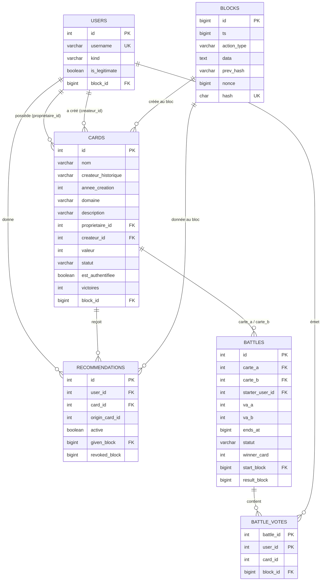

# Schéma de la base de données

Responsable : Iyore. Base PostgreSQL hébergée sur `linserv-info-01` (LAN de l'IUT).

## 1. Principes

* Seul le **serveur** lit et écrit dans la base. Les clients n'y accèdent jamais.
* La table `blocks` est la **sauvegarde de la blockchain** et la référence.
* Les autres tables sont un **état courant dérivé** de la blockchain. Elles évitent de parcourir toute la chaîne à chaque consultation.
* Un bloc et la mise à jour de l'état qu'il provoque sont écrits dans **une seule transaction** : les deux écritures sont validées ou annulées ensemble.
* En cas de perte ou d'incohérence de l'état, on le reconstruit entièrement à partir de `blocks` (section 5).

## 2. Modèle relationnel



<!-- png: diagrammes-blockchain-bdd/01-schema-bdd.png -->
*Diagramme `01-schema-bdd.png` : schéma relationnel (ce n'est pas un diagramme UML).*

## 3. Définition des tables

```sql
CREATE TABLE blocks (
    id           BIGINT       PRIMARY KEY,
    ts           BIGINT       NOT NULL,
    action_type  VARCHAR(24)  NOT NULL,
    data         VARCHAR(1024) NOT NULL,
    prev_hash    VARCHAR(64)  NOT NULL,
    nonce        BIGINT       NOT NULL,
    hash         CHAR(64)     NOT NULL UNIQUE
);
-- Le genesis a prev_hash = '0' (hash précédent nul), d'où VARCHAR et non CHAR(64).

CREATE TABLE users (
    id             INTEGER      PRIMARY KEY,
    username       VARCHAR(30)  NOT NULL UNIQUE,
    kind           VARCHAR(5)   NOT NULL CHECK (kind IN ('HUMAN', 'BOT')),
    is_legitimate  BOOLEAN      NOT NULL DEFAULT FALSE,
    block_id       BIGINT       NOT NULL REFERENCES blocks(id)
);

CREATE TABLE cards (
    id                  INTEGER       PRIMARY KEY,
    nom                 VARCHAR(50)   NOT NULL,
    createur_historique VARCHAR(100)  NOT NULL,
    annee_creation      INTEGER       NOT NULL,
    domaine             VARCHAR(12)   NOT NULL
        CHECK (domaine IN ('Web', 'GameDev', 'DataScience', 'Systems', 'Mobile')),
    description         VARCHAR(500)  NOT NULL,
    proprietaire_id     INTEGER       NOT NULL REFERENCES users(id),
    createur_id         INTEGER       NOT NULL REFERENCES users(id),
    valeur              INTEGER       NOT NULL DEFAULT 0,
    statut              VARCHAR(12)   NOT NULL DEFAULT 'ACTIVE'
        CHECK (statut IN ('ACTIVE', 'EN_BATTLE', 'AUTHENTIFIEE', 'INACTIVE')),
    est_authentifiee    BOOLEAN       NOT NULL DEFAULT FALSE,
    victoires           INTEGER       NOT NULL DEFAULT 0,
    block_id            BIGINT        NOT NULL REFERENCES blocks(id)
);

CREATE TABLE recommendations (
    id              SERIAL   PRIMARY KEY,
    user_id         INTEGER  NOT NULL REFERENCES users(id),
    card_id         INTEGER  NOT NULL REFERENCES cards(id),
    origin_card_id  INTEGER  NOT NULL REFERENCES cards(id),
    active          BOOLEAN  NOT NULL DEFAULT TRUE,
    given_block     BIGINT   NOT NULL REFERENCES blocks(id),
    revoked_block   BIGINT   REFERENCES blocks(id)
);
-- Une seule recommandation active par couple (utilisateur, carte).
CREATE UNIQUE INDEX uq_reco_active ON recommendations(user_id, card_id) WHERE active;

CREATE TABLE battles (
    id              INTEGER      PRIMARY KEY,
    carte_a         INTEGER      NOT NULL REFERENCES cards(id),
    carte_b         INTEGER      NOT NULL REFERENCES cards(id),
    starter_user_id INTEGER      NOT NULL REFERENCES users(id),
    va_a            INTEGER      NOT NULL,
    va_b            INTEGER      NOT NULL,
    ends_at         BIGINT       NOT NULL,
    statut          VARCHAR(8)   NOT NULL CHECK (statut IN ('ONGOING', 'FINISHED')),
    winner_card     INTEGER      REFERENCES cards(id),
    start_block     BIGINT       NOT NULL REFERENCES blocks(id),
    result_block    BIGINT       REFERENCES blocks(id)
);

CREATE TABLE battle_votes (
    battle_id  INTEGER  NOT NULL REFERENCES battles(id),
    user_id    INTEGER  NOT NULL REFERENCES users(id),
    card_id    INTEGER  NOT NULL REFERENCES cards(id),
    block_id   BIGINT   NOT NULL REFERENCES blocks(id),
    PRIMARY KEY (battle_id, user_id)
);
```

### Correspondance avec les règles métier

| Règle | Contrainte portée par le schéma |
| :--- | :--- |
| Unicité d'une recommandation active par carte et par utilisateur | Index unique partiel `uq_reco_active` |
| Un vote par utilisateur et par battle | Clé primaire `(battle_id, user_id)` |
| Domaines autorisés | `CHECK` sur `cards.domaine` |
| Statuts autorisés | `CHECK` sur `cards.statut` |
| Historique immuable | Les recommandations répudiées restent en base (`active = FALSE`, `revoked_block`), les cartes perdantes restent en base (`INACTIVE`) |
| Limite de 10 cartes actives | Vérifiée par le serveur (requête de comptage), pas par le schéma |

Le champ `cards.valeur` est une valeur dérivée : `COUNT(recommandations actives) + 10 * est_authentifiee`. Il est stocké pour accélérer les consultations et recalculé à chaque action, jamais modifié à la main.

## 4. Écriture dans une transaction

À chaque action validée, le serveur exécute :

```sql
BEGIN;
INSERT INTO blocks (...) VALUES (...);
-- puis, selon l'action : INSERT/UPDATE sur users, cards, recommendations, battles, battle_votes
COMMIT;
```

Si une instruction échoue, le serveur exécute `ROLLBACK`. Le bloc reste dans la blockchain en mémoire et passe en file de sauvegarde (voir [cas-erreur.md](cas-erreur.md)). La sauvegarde reprend dans l'ordre des `id` dès que la base répond.

## 5. Restauration et reconstruction

### 5.1 Démarrage normal

1. Le serveur se connecte à PostgreSQL. En cas d'échec, il démarre avec un genesis seul en mémoire.
2. `SELECT … FROM blocks ORDER BY id` charge la chaîne.
3. La chaîne est vérifiée (`blockchain_verify`). Si elle est corrompue, le serveur le signale et refuse de charger un contexte douteux : il s'arrête avec un message d'erreur.
4. Chaque bloc est rejoué (`apply_block`) pour reconstruire l'état en mémoire.
5. Les tables d'état sont comparées à l'état reconstruit. En cas de différence, elles sont reconstruites.

### 5.2 Reconstruction des tables d'état

```sql
BEGIN;
TRUNCATE battle_votes, battles, recommendations, cards, users CASCADE;
-- rejeu de tous les blocs dans l'ordre : mêmes INSERT/UPDATE que pendant le fonctionnement
COMMIT;
```

La reconstruction réutilise le même code d'application d'un bloc que le fonctionnement normal. Elle garantit que l'état courant en base est toujours une conséquence de la blockchain.

## 6. Accès depuis le serveur C

* Bibliothèque : `libpq` (`#include <libpq-fe.h>`, option `-lpq`).
* Une seule connexion `PGconn`, protégée par un verrou : les écritures sont déjà sérialisées par le verrou de la chaîne.
* Requêtes paramétrées (`PQexecParams`) pour toutes les valeurs venant d'un client, afin d'éviter l'injection SQL.
* Les paramètres de connexion (hôte, base, utilisateur, mot de passe) viennent d'un fichier de configuration local exclu du dépôt (`.gitignore`).
