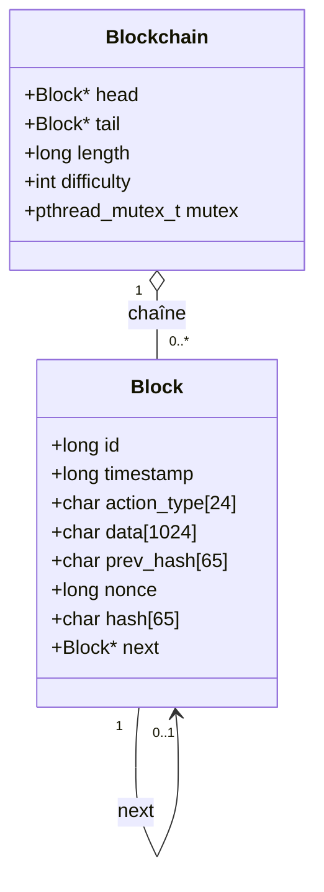
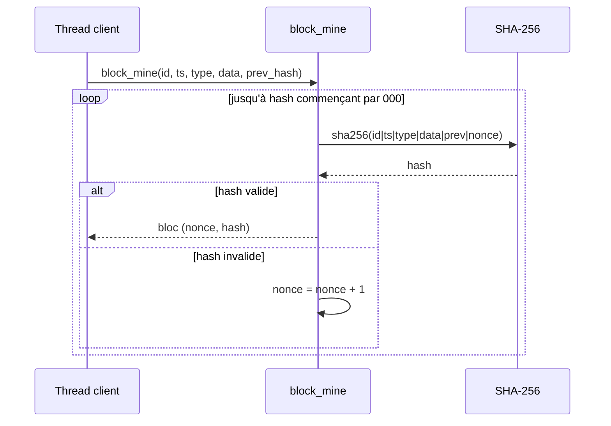
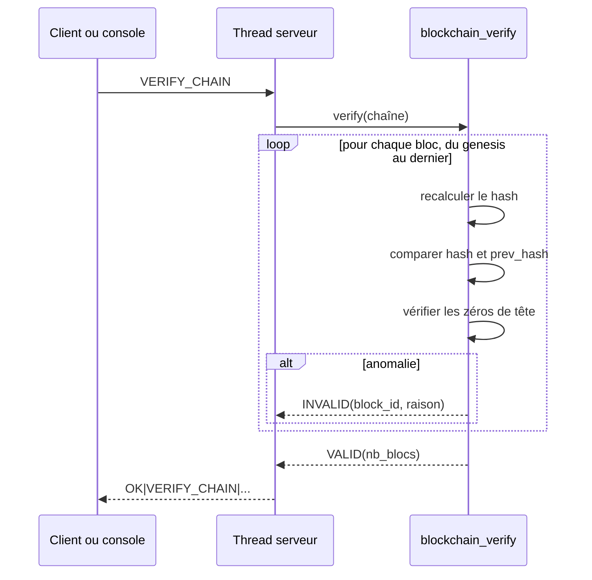
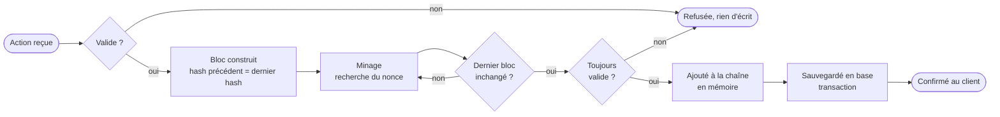

# Structures de la blockchain

Responsable : Iyore. Ce document définit la blockchain privée simplifiée de la plateforme : structure d'un bloc, calcul du hash, minage, vérification de l'intégrité et contenu des blocs pour chaque action.

La blockchain est une liste chaînée de blocs, tenue par un **serveur unique** (pas de réseau pair à pair). Elle sert de support de traçabilité et de référence pour reconstruire l'état de la plateforme.

## 1. Structure d'un bloc

| Champ | Type C | Rôle | Entre dans le hash |
| :--- | :--- | :--- | :---: |
| `id` | `long` | Identifiant unique, croissant. Le genesis vaut `0`. | oui |
| `timestamp` | `long` | Date de création en secondes Unix (UTC), via `time()` | oui |
| `action_type` | `char[24]` | Type d'action, par exemple `ACTION_RECOMMEND` | oui |
| `data` | `char[1024]` | Données de l'action (voir section 4) | oui |
| `prev_hash` | `char[65]` | Hash du bloc précédent en hexadécimal (64 caractères + `\0`) | oui |
| `nonce` | `long` | Compteur de la preuve de travail | oui |
| `hash` | `char[65]` | Hash courant en hexadécimal | non (résultat) |
| `next` | `struct block *` | Pointeur de chaînage en mémoire | non |

Le pointeur `next` appartient à la liste chaînée en mémoire. Il n'est ni sauvegardé en base ni utilisé dans le calcul du hash, conformément au cahier des charges.



<!-- png: diagrammes-blockchain-bdd/00-blockchain.png -->
*Diagramme `00-blockchain.png` : structure des blocs et de la chaîne.*

## 2. Calcul du hash

Le hash courant est le SHA-256, en hexadécimal minuscule, de la chaîne :

```text
<id>|<timestamp>|<action_type>|<data>|<prev_hash>|<nonce>
```

Les cinq éléments utilisés sont ceux imposés par le cahier des charges : identifiant, horodatage, données de l'action, hash précédent et nonce. La fonction de calcul est unique (`block_compute_hash`) et sert au minage comme à la vérification, ce qui garantit que les deux appliquent la même règle.

Le SHA-256 est calculé avec OpenSSL (`#include <openssl/sha.h>`, option `-lcrypto`).

## 3. Genesis, preuve de travail et difficulté

* **Genesis :** `id = 0`, `action_type = "ACTION_GENESIS"`, `data = "genesis"`, `prev_hash = "0"` (hash précédent nul). Il est miné comme les autres blocs.
* **Difficulté :** `DIFFICULTY = 3`. Un hash est valide si ses 3 premiers caractères hexadécimaux sont `0`. Cette valeur est un paramètre de compilation modifiable (4 reste raisonnable sur les postes de l'IUT).
* **Minage :** on part de `nonce = 0` et on incrémente le nonce jusqu'à obtenir un hash valide. Une difficulté de 3 demande en moyenne 4096 calculs, soit quelques millisecondes.



<!-- png: diagrammes-blockchain-bdd/02-sequence-minage.png -->
*Diagramme `02-sequence-minage.png` : minage d'un bloc.*

### Minage et concurrence

Le minage est le seul calcul long du serveur. Il s'exécute **dans le thread du client demandeur, sans verrou global**, donc il ne bloque pas les autres clients. Le principe, appelé ici minage optimiste, est détaillé dans [architecture-serveur.md](architecture-serveur.md) :

1. le thread lit l'`id` et le `hash` du dernier bloc (verrou très court) ;
2. il mine son bloc hors de tout verrou ;
3. il reprend le verrou de la chaîne et vérifie que le dernier bloc n'a pas changé ;
4. s'il a changé, le hash précédent n'est plus bon : le thread relance le minage avec le nouveau dernier bloc.

## 4. Contenu des blocs par action

Le champ `data` est une suite de champs séparés par `|`, dans un ordre fixe pour chaque type d'action. Les champs texte ne contiennent jamais `|` (règle du protocole). Les identifiants sont des entiers décimaux.

| `action_type` | Format de `data` | Effet à la restauration |
| :--- | :--- | :--- |
| `ACTION_GENESIS` | `genesis` | Aucun |
| `ACTION_REGISTER_USER` | `user_id\|username\|kind` | Crée l'utilisateur (`kind` : `HUMAN` ou `BOT`) |
| `ACTION_CREATE_CARD` | `user_id\|card_id\|nom\|createur_historique\|annee\|domaine\|description` | Crée la carte `ACTIVE`, VA 0, propriétaire = créateur |
| `ACTION_RECOMMEND` | `user_id\|card_id` | Ajoute une recommandation active, VA + 1 |
| `ACTION_REPUDIATE` | `user_id\|card_id` | Désactive la recommandation, VA − 1 |
| `ACTION_BATTLE_START` | `user_id\|battle_id\|card_a\|card_b\|va_a\|va_b\|ends_at` | Crée la battle, cartes `EN_BATTLE`, VA initiales mémorisées |
| `ACTION_BATTLE_VOTE` | `user_id\|battle_id\|card_id` | Enregistre le vote |
| `ACTION_BATTLE_RESULT` | `battle_id\|winner_card\|loser_card\|votes_a\|votes_b\|tiebreak\|nb_transferees` | Applique le résultat : transfert des recommandations, perdante `INACTIVE` |
| `ACTION_LEGITIMATION` | `user_id\|card_id` | `is_legitimate = true` pour l'utilisateur |
| `ACTION_CLAIM_CARD` | `user_id\|card_id\|ancien_proprietaire_id` | Change le propriétaire de la carte |
| `ACTION_AUTHENTICATE_CARD` | `user_id\|card_id` | Carte `AUTHENTIFIEE`, `est_authentifiee = 1`, VA + 10 |

Les actions refusées ne produisent aucun bloc. Les bots ne se distinguent pas par un type d'action propre : l'utilisateur de chaque bloc porte l'attribut `kind`, ce qui permet de séparer leurs actions de celles des humains.

### Exemple

```text
id=7 timestamp=1790000000 action_type=ACTION_RECOMMEND data=2|1
prev_hash=000a3f…  nonce=1893  hash=000c91…
```

## 5. Vérification de l'intégrité

La fonction `blockchain_verify` parcourt la chaîne du genesis jusqu'au dernier bloc. Pour chaque bloc, elle contrôle dans cet ordre :

| Contrôle | Anomalie signalée |
| :--- | :--- |
| Le hash recalculé à partir des champs du bloc est identique au hash stocké | `BAD_HASH` |
| Le `prev_hash` est identique au hash du bloc précédent (`"0"` pour le genesis) | `BAD_PREV_HASH` |
| Le hash commence par `DIFFICULTY` zéros | `BAD_POW` |

Elle s'arrête au premier bloc en anomalie et renvoie son `id` et la raison. Modifier une donnée dans un bloc change son hash recalculé : l'altération est donc détectée sur ce bloc, même si l'attaquant ne touche à aucun autre champ. Si l'attaquant recalcule aussi le hash du bloc modifié, le bloc suivant signale `BAD_PREV_HASH`.



<!-- png: diagrammes-blockchain-bdd/03-sequence-verification.png -->
*Diagramme `03-sequence-verification.png` : vérification de la chaîne.*

Le test d'altération demandé en phase 2 modifie la colonne `data` d'un bloc directement en base, redémarre le serveur et lance `VERIFY_CHAIN` : la réponse doit désigner ce bloc avec la raison `BAD_HASH`.

## 6. Cycle de vie d'un bloc



<!-- png: diagrammes-blockchain-bdd/04-blockchain-etats.png -->
*Diagramme `04-blockchain-etats.png` : cycle de vie d'un bloc, de la demande à la confirmation. C'est un schéma de flux, pas un diagramme d'états UML, afin de rester dans la limite de cinq types de diagrammes UML.*

## 7. Restauration à partir de la blockchain

Au démarrage, le serveur charge les blocs de la base dans l'ordre des `id`, vérifie la chaîne, puis **rejoue chaque bloc** avec la même fonction `apply_block` que celle utilisée en fonctionnement. Un seul chemin de code produit l'état, en direct comme à la restauration, ce qui évite qu'ils divergent. La blockchain est la référence : les tables d'état de la base sont reconstruites depuis elle (voir [schema-bdd.md](schema-bdd.md)).

Une battle sans bloc `ACTION_BATTLE_RESULT` à la fin du rejeu est clôturée immédiatement selon les règles de départage (précision P4 des [règles métier](regles-metier.md)). Cette clôture produit un nouveau bloc de résultat.
